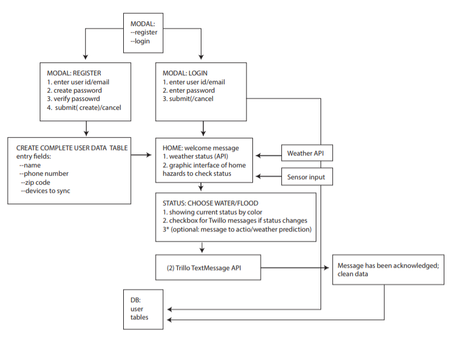

# Horus:
## Keeping an eye on your home.

Horus is an alarm monitoring application to provide the user with real time monitoring utilizing various inputs from your home - ie. water sensors, smoke detectors along with APIs that will notifiy you of potential adverse weather and natural events.

## Usage:

## Hardware Requirements:

- Raspberry Pi 3B
- Bread Board with GPIO breakout 
- Jumper Wires
- Water Sensor with DAC circuit
- PIR Sensor
- IR Flame Sensor

## Software Requirements:

# Front End:

- HTML5
- CSS
- Bootstrap
- javaScript
- jQuery
- Handlebars
- Python

# Back End:
- Node
- Express

# npm packages:

[moment.js](https://momentjs.com/)
[weather.js](https://www.npmjs.com/package/weather-js)
[cookie-parser](https://www.npmjs.com/package/cookie-parser)
[mocha](https://www.npmjs.com/package/mocha)
[chia](https://www.npmjs.com/package/chai)

# API's:

[Twilio](https://www.twilio.com/docs/iam/api)

## Contributors
[Davis](https://github.com/daveyjonezz)
[Jenny](https://github.com/jenshin75)
[Madeleine](https://github.com/MadeleineKemeny)
[Mari](https://github.com/Mari0203)
[Susan](https://github.com/Sooze16)
[Ying](https://github.com/yzhouyzhou)

#Acknowledgements:
[Piddler In the Root](https://www.piddlerintheroot.com/)
*Tutorials and python code can be found here for the RPi sensors.

