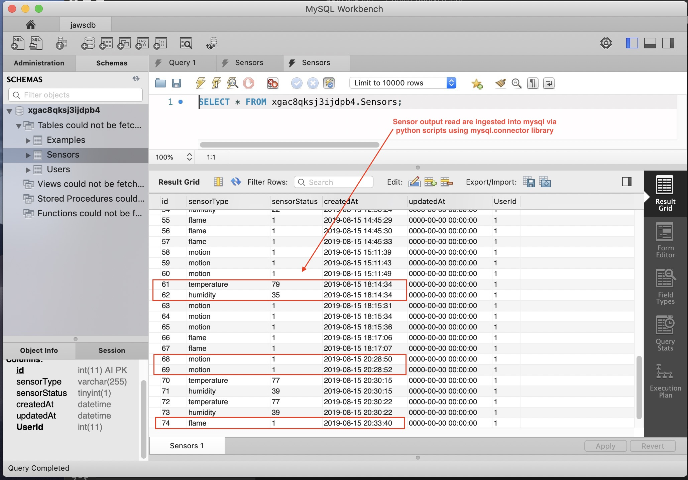

# Horus: 
## *Keeping an eye on your home*

Horus is an alarm monitoring application to provide the user with real time monitoring utilizing various inputs from your home - ie. water sensors, smoke detectors along with APIs that will notifiy you of potential adverse weather and natural events.

## Flow Chart

## Hardware Requirements

- Raspberry Pi 3b+
- Water Sensor with DAC circuit
- Temperature & Humidity sensor
- PIR Motion Sensor
- Flame Sensor
- Bread Board with GPIO breakout 
- Jumper Wires
 

## Software Requirements

|     Front-end       |       Back-end     |
|:------------------- |:------------------ |
| <ul><li>HTML5</li><li>Bootstrap</li><li>JavaScript</li><li>jQuery</li><li>Handlebars.js</li></ul>| <ul><li>Node.js</li><li>Express</li><li>Python</li><li>Raspbian/Linux</li><li>MySQL</li><li>Heroku</li></ul> |

## Packages & Libraries

### npm packages:
- [moment.js](https://momentjs.com/)
- [weather.js] (https://www.npmjs.com/package/weather-js)
- [mocha](https://www.npmjs.com/package/mocha)
- [chia](https://www.npmjs.com/package/chai)

### Python libararies
- [RPi.GPIO](https://pypi.org/project/RPi.GPIO/)
- [time](https://docs.python.org/3/library/time.html)
- [datetime](https://docs.python.org/3/library/datetime.html#module-datetime)
- [urllib](https://docs.python.org/3/library/urllib.html#module-urllib)
- [pymysql](https://pypi.org/project/PyMySQL/)
- [dht11](https://www.arduinolibraries.info/libraries/dht-sensor-library)

## API's:
- [Twilio](https://www.twilio.com/docs/iam/api)
- [Weather] (https://www.npmjs.com/package/weather-js)
- [cookie-parser](https://www.npmjs.com/package/cookie-parser)
- [mocha](https://www.npmjs.com/package/mocha)
- [chia](https://www.npmjs.com/package/chai)

## Contributors
- [Davis](https://github.com/daveyjonezz)
- [Jenny](https://github.com/jenshin75)
- [Madeleine](https://github.com/MadeleineKemeny)
- [Mari] (https://github.com/Mari0203)
- [Susan](https://github.com/Sooze16)
- [Ying](https://github.com/yzhouyzhou)

## Acknowledgements
[Piddler In the Root](https://www.piddlerintheroot.com/
*Tutorials and python code can be found here for the RPi sensors.*

[Raspberry Pi Documentation] (https://www.raspberrypi.org/documentation/)
[Python Standard Library] (https://docs.python.org/3/library/)

## Notes

